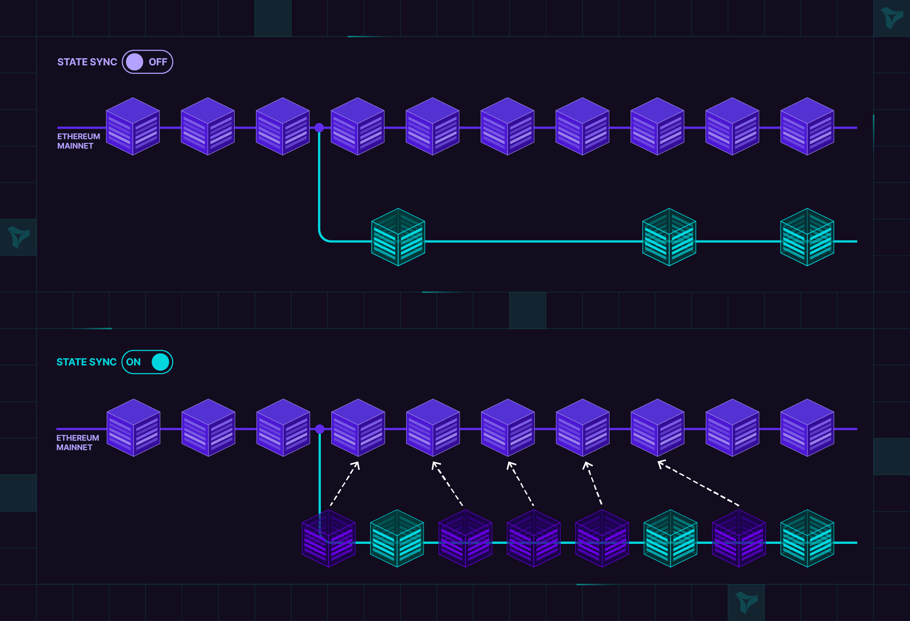

# State Sync on Virtual TestNet

[State Sync](https://docs.tenderly.co/virtual-testnets/state-sync) is a powerful feature that allows the Virtual TestNet
to have access to the mainnet data it diverged from as they both progress.

## Example

The example demonstrates the following:

- TestNet (Virtual Sepolia) accesses the latest state from original network (Sepolia).
- After a TestNet **`write`**, the modified variable detaches from the Sepolia counterpart.
- Note: you may find write to Sepolia don't show up in the output. This is because of latency in block confirmation.

The example uses a modified [Counter contract](./contracts/src/Counter.sol), that contains a map of counters. It's
deployed on Sepolia at `0xd01dF6d2354c5A869265dC9a9561E3544ac53262`.

The [test script](./src/index.ts) will interact with both Sepolia and a Virtual TestNet based on
Sepolia - `Virtual Sepolia`.

The script takes a random entry in the counter map, and then:

- sets the value on Sepolia, then reads values on both Sepolia and Virtual Sepolia
- sets the value on Virtual Sepolia, then reads values on both Sepolia and Virtual Sepolia
- again sets the value on Sepolia, then reads values on both Sepolia and Virtual Sepolia

## Environment setup

Create a [new TestNet](https://docs.tenderly.co/virtual-testnets/quickstart) based on Sepolia, using `735711155111` for
the custom Chain ID.

- **`TENDERLY_VIRTUAL_TESTNET_CHAIN_ID`** the chain ID of the testnet. Use `735711155111`
- **`TENDERLY_VIRTUAL_TESTNET_RPC_URL_SEPOLIA`** the RPC URL of the TestNet
- **`PRIVATE_KEY`** for signing test transactions

```bash
cp .env.example .env
vi .env # modify environment variables
```

## Run the example

Provide a private key to `ts-node` command to sign transactions that write values to `Counter` deployed at Sepolia.

```bash
cd virtual-testnets-state-sync
yarn install
npx ts-node src/index.ts
```

### Results

Key points to notice in **`Write`**:

1. After writing to sepolia (`1`), both sepolia and virtualSepolia read value `1` - the latest state of the original
   network.
2. After writing to Virtual Sepolia (`10`), reading from sepolia gives the previously set value (`1`), and reading from
   virtualSepolia gives recently set value (`10`).
3. After writing to Sepolia again (`100`), reading from sepolia gives the latest set value (`100`), and reading from
   virtualSepolia gives previously set value (`10`).

``` lines={2,5}
Playing with Counter(0xd01dF6d2354c5A869265dC9a9561E3544ac53262).numbers[3788720642447205]
State:
  sepolia: 0
  virtualSepolia: 0

================================================================================================
Write: Counter(0xd01dF6d2354c5A869265dC9a9561E3544ac53262)@Sepolia.numbers[3788720642447205] = 1
Tx hash: 0xe57c5da70c68d55f86957f7a2fc2644670b032fe5f972b9e9ccc2774cd2ba352
State:
  sepolia: 1
  virtualSepolia: 1

================================================================================================
Write: Counter(0xd01dF6d2354c5A869265dC9a9561E3544ac53262)@Virtual Sepolia.numbers[3788720642447205] = 10
Tx hash: 0x56099d89c1d6fd001a1e9a0cecca13e13c04013b473acb6a48cd61a4b988696c
State:
  sepolia: 1
  virtualSepolia: 10

================================================================================================
Write: Counter(0xd01dF6d2354c5A869265dC9a9561E3544ac53262)@Sepolia.numbers[3788720642447205] = 100
Tx hash: 0xc3c37e912bfa4fca9b980339fa2c95dbef75d6c605f0df831ca985b0ef3b61ec
State:
  sepolia: 100
  virtualSepolia: 10
```

